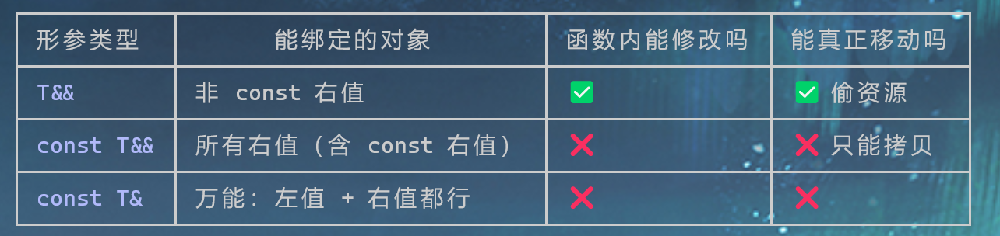

# 1.Cmake
```code
//强制要求cmake版本不低于3.25
cmake_minimum_required(VERSION 3.25)

//强制覆写c、c++编译器选择为路径中的位置，而不是由系统自行决定
set(CMAKE_C_COMPILER "/usr/bin/gcc" CACHE FILEPATH "C compiler" FORCE)
set(CMAKE_CXX_COMPILER "/usr/bin/g++" CACHE FILEPATH "C++ compiler" FORCE)

set(CMAKE_CXX_STANDARD 20)   //确定c++标准为20
set(CMAKE_CXX_STANDARD_REQUIRED ON) //强制要求为20，不允许切换
set(CMAKE_CXX_EXTENSIONS ON)  //启用编译扩展，导致代码无法迁移到其他编译器，同时允许一些编译器特有的语法

project(pans VERSION 0.1.0 LANGUAGE CXX C) //声明项目名，版本，使用语言
include(GNUInstallDirs) //引入标准安装目录变量，符合GNU惯例，避免硬编码，提升移植性
include(CMakePackageConfigHelpers) 生成包配置文件，支持外部项目find_package(pans)引用

//设置变量从而达到控制编译对象，也就是example，test，tool模块是否要编译
option(PANS_BUILD_EXAMPLES "Bulid examples" ON)
option(PANS_BUILD_TESTS "Bulid tests" ON)
option(PANS_BUILD_TOOLS "Bulid tools" ON)

//设置cmake的编译构建类型，有Debug Release RelWithDebInfo MinSizeRel四种类型
if(NOT CMAKE_CONFIGURATION_TYPES AND NOT CMAKE_BUILD_TYPE) //如果没有配置多生成器和单生成器，就设置单生成器为Debug模式
    set(CMAKE_BUILD_TYPE Debug CACHE STRING "Choose the type of build." FORCE)
endif()
set_property(CACHE CMAKE_BUILD_TYPE PROPERTY STRINGS Debug Release RelWithDebInfo MinSizeRel)
message(STATUS "Build Type: ${CMAKE_BUILD_TYPE}") //输出日志

cmake_host_system_information(RESULT CPU_NUMS QUERY NUMBER_OF_LOGICAL_CORES) //征询程序查询有多少个处理器
message(STATUS "CPU_NUMS on current server is: ${CPU_NUMS}")
math(EXPR JOBS "${CPU_NUMS} * ${CPU_NUMS} /2") //计算理想线程数
set(CMAKE_BUILD_PARALLEL_LEVEL ${JOBS} CACHE STRING "并行编译线程数")
message(STATUS "Complier default work jobs: ${CMAKE_BUILD_PAPALLEL_LEVEL}")

//可以适当通过任务超配来补足I/O导致的时间浪费，从而使得cpu资源得到充分使用

add_library(pans_options INTEFACE) //配置编译接口，不产生编译产物，只记录配置

//当编译器为gnu或clang，启用一下设置
target_compile_options(pans_options INTERFACE
    $<$<OR:$<CXX_COMPILER_ID:GNU>,$<CXX_CO<PLIER_ID:Clang>>:
        -Wall
        -Wextre
        -Wpedantic
        -fno-strict-aliasing
    >
)

//在linux系统上，
target_compile_options(pans_options,INTERFACE
    $<$<AND:$<PLATFORM_ID:Linux>,$<OR:$<CXX_COMPILER_ID:GNU>,$<CXX_CO<PLIER_ID:Clang>>>:
        -fPIC     
    >
)
编译参数
target_compile_options(pans_options INTERFACE
    $<$<CONFIG:Debug>: -o0>  优化
    $<$<CONFIG:Debug>: -g3>  调试信息
    $<$<CONFIG:Debug>: -ggdb> 适合gdb调试的拓展
)
```
# 2.assert封装
assert本质上就是宏定义包装的库，作为开发阶段的调试辅助宏
在于触发断言条件为假时，会向stdcerr输出表示性文本，__FILE__,__LINE__,__FUNC__,然后调用abort()终止进程

## NDEBUG宏
定义NDEBUG宏后，所有assert会被编译为空指令

debug模式下，需要额外时间来判断逻辑
release模式下，不然

```code
 if(!(x)) [[unlikely]] //告诉CPU 该条指令出现的可能不大，分支预测时，可以放心将其减少分配
    {
        std::cerr <<__FILE__ <<":"<<__LINE__<< "ASSERT FAILED: " <<#X <<"\nStacktrace: to do \n";
        assert(x)
    }

```
定义多行宏时，使用\来表示续行符
static_assert 编译期使用，几乎无开销

在连接对应库时，一般会将可连接对象直接展开，配置宏定义时,使用do——while(0)来避免对应的语法错误，如多一个分号
```code
#define ASSERT_RETVAL(x, val) \
    do{\
        if(x) [[likely]] break;\
        PANS_ASSERT(x);\
        return val;\
    }while(0)
```

[[nodiscard]] **C++17 引入的属性 (attribute)**，属于标准的**方括号属性语法 `[[...]]`**，给编译器提示信息，用于检测「函数返回值被故意忽略」的代码问题。

作用：
这个函数的返回值很重要，调用方不应该丢弃、不能不接收返回值；如果调用后直接忽略返回值，编译器给出警告

# 3.线程安全
lamda表达式中，全局变量不需要捕获的，其捕获的是局部变量
c++中的线程只要初始化就开始运行，不同于其他语言需要显式的启动

对于简单的循环变量，在开启03优化时，会进行循环优化，使得下列代码测不出数据竞争
```code
 []()->void{
 for(int i=0;i<count;++i)
 {
     ++money;
 }}
```
数据竞争的原因在于取数时不确定是什么时候的数，自增运算要分三步，取数，计算，存数

锁：在于保护数据，而不是语句

正确的思考顺序是：

1. 找出所有访问共享数据的代码 → 这些代码构成“临界区”
2. 锁必须完整覆盖临界区——漏掉任何一处访问，等于没锁
3. 不碰共享数据的重活，尽量留在锁外（这才是“粒度”的本意）

数据加锁：
1. 互斥锁mutex：
同一时间只有一个线程持有锁，最常用
不可拷贝，移动，不能对持锁线程再加锁，会造成死锁。

递归锁recursive_mutex：
同一线程可以重复加锁，只在于递归函数、嵌套中保护同一资源时使用

超时锁timed_mutex
允许线程等待超时，放弃持锁，防死锁，

读写锁 shared_mutex
读锁可多线程共享，但是写锁独占，适合读多写少
对于这个可以采用unique_lock(独占锁，写锁)，shared_lock(共享锁，读锁)

2. 信号量：
计数信号量counting_semaphore：
控制同时可用的资源数量

二元信号量binary_semaphore：
值为0或1，本质就是线程间事件通知

原子标志atomic_flag：
c++中唯一无锁原子类型

原子变量:
对于1/2/4/8字节的整型，编译器会生成CPU硬件原子指令，使得读改写在硬件层面不可分割，无需加锁

3.辅助加锁：
lock_guard RAII锁
构造时加锁，析构时解锁

unique_lock 灵活锁
在前者基础上，维护锁的状态，支持手动解锁

scoped_lock 多锁同时获取
一次锁定多个互斥量，避免死锁。

单线程：atomic最快，mutex有锁开销
多线程：atomic领先，mutex随线程数增加竞争加剧


## 线程间关系：
互斥：多个线程竞争同一独占资源，谁拿到谁占有
同步：多个线程按顺序配合执行完成一件事

互斥锁用来解决互斥
信号量用来解决同步，可以作为资源计数

## 自旋锁：
1. POSIX 自旋锁
pthread_spinlock特性：
抢锁失败会导致反复检查，不进入休眠，持续轮询锁状态
不主动放弃CPU，自旋期间占用核心，等待期间不切换线程
各平台实现并不相同

2. atomic_flag实现自旋锁

### 按照平台引入指定头文件
```code
#if defined(__x86_64__) || defined(__i386__)
#include<immintrin.h>
#elif defined(__aarch64__) || defined(__arm__)
#include<arm_acle.h>
#endif

#if defined(__linux__) && defined(__GLIBC__)
#include<pthread.h>
#endif

inline void cpu_relax() noexcept
{
    #if defined(__x86_64__) || defined(__i386__)
        _mm_pause(); //是CPU为自旋等待的特殊指令，x86上
    #elif defined(__aarch64__) || defined(__arm__)
        __yield();   //同上，但是是arm上
    #endif
}
```

inline+noexcept 零开销且无异常抛出

```code
原子变量只有0，1态

第一个线程进来时，mutex是false状态 ，然后为true，返回false，则外层循环终止

第二个线程来时，mutex是True状态，仍会设置为true，但是返回true，进入循环，判断内层循环。若为true则cpu等待，false则跳出
> 从而优化cpu运行
void lock() noexcept
    {//test_and_set函数会将mutex设置为True，然后返回原来的值
        while(m_mutex.test_and_set(std::memory_order_acquire))
        {
            while(m_mutex.test(std::memory_order_relaxed))
            {
                cpu_relax();
            }
        }
    }
两层结构，外层抢锁，内层探测
```

# 4. 日志

## 接口设计cmake
1. 接口设置
```code
#if defined(_WIN32) && defined(PANS_SHARED_LIBRARY) //是win32系统且是动态定义库PANS_SHARED_LIBRARY
#if define(PANS_BUILDING_LIBRARY)   //若编译时，定义了这个库
#define PANS_API __declspec(dllexport) //则通过declspec将连接符号都导入到dll中
#else
#define PANS_API __declspec(dllimport) //其他项目使用，则通过PANS_API来导入
#endif

#elif defined(__GNU__) && defined(PANS_SHARED_LIBRARY)
#define PANS_API __arrtibute__((visibility("default")))
#else
#define PANS_API
#endif
```

由此在函数或类名前使用PANS_API作为导出给动态库

#### 不可继承final
类名后+final表示不可继承

枚举变量类型 name：type 显式告诉编译器其中元素类型，不写默认为int
```code
enum class Level : std::uint8_t
```
X-Macro 交叉宏
把枚举值翻译成对应的字符串——传入 DEBUG，同时生成 LOG_LV_DEBUG
   这个枚举常量和 "DEBUG" 这个字符串。
```code
switch (level)
          {
  #define xx(name)               \
      case Level::LOG_LV_##name: \
          return #name;
              xx(DEBUG)
                  xx(INFO)
                      xx(WARN)
                          xx(ERROR)
                              xx(FATAL)
                                  xx(OFF)
  #undef xx
          }
```
本质上是将重复代码缩成宏展开
##是记号标记，用于将参数黏贴到对应位置
#是字符串化

命名空间 pans::detail
等价于namespace pans {namespace detail}

短日志放在栈上、长日志放在堆上，尽可能使用栈上
自定义缓冲区，从而减少string在拷贝时的开销

避免逻辑优化，可以使用一些额外的代价来取消
```code
u64 checksum = 0;
    const auto begin = std::chrono::steady_clock::now();
    for (u64 iteration = 0; iteration < g_target; ++iteration)
    {
        checksum += operation();
    }
    const auto end = std::chrono::steady_clock::now();
    BENCHMARK_SINK.fetch_xor(checksum, std::memory_order_relaxed);
    return std::chrono::duration_cast<std::chrono::nanoseconds>(end - begin);
```
BENCHMARK_SINK作为全局变量，编译器不保证其会不会被用到，故一直保留观察，同时fetch_xor是会保守处理操作。fetch_xor是原子性的“读写改”，即fetch_* 类型的函数都是如此，*是操作类型，xor就是做异或。memory_order_relaxed 只是放弃与其他内存操作的顺序保证（省去内存屏障开销，避免污染测量结果
  ），它并不降低操作本身的可观察性——这一次写入仍然必须真实发生。

memory_order类参数，在于修改指令顺序，编译器CPU会重排指令、缓存内存数据。这些参数在于约束


```code
static_cast<u64>(value.size()) +
           static_cast<unsigned char>(value.front()) +
           static_cast<unsigned char>(value[value.size() / 2]) +
           static_cast<unsigned char>(value.back());
```
这样可以使得每次操作一定是从缓冲区实实在在的获得数据，由此再确保测试的正确性


explicit 禁止编译器产生隐式转换

在linux系统中
localtime_r是线程安全的，但是消耗也大：
* 1. 全局有锁可能排队
* 2. 需要进行复杂的时区计算(尤其是有过夏令时变更历史的时区)
* 3. 如果系统没有加载时区信息或者要求响应时区变更, 每次调用这个接口还要去发起磁盘IO，读系统文件/etc/localtime

```code
using FormatItemFactory = std::unique_ptr<Formatter::FormatItem> (*)(std::string_view)
```
这是一种函数指针的申明方式，别名使其更具有可读性，本质是返回类型是std::unique_ptr<Formatter::FormatItem>，参数为string_view


```code
 m_item.push_back(std::make_unique<LiteralFormatItem>(std::move(literal)));
```
 std::move 本身不移动任何东西

  它只是一次强制类型转换，把左值 literal 转成右值引用：

  std::move(literal)  // 近似等价于 static_cast<std::string&&>(literal)

  真正干活的是被它「标记」出来的移动构造函数。效果对比：

  std::string literal = "2026-09-12 [logger] 一大段字面文本...";

  // 不加 move → 拷贝构造：新对象申请内存，逐字节复制内容（O(n)）
  std::make_unique<LiteralFormatItem>(literal);

  // 加 move → 移动构造：新对象直接"接管"literal 内部的缓冲区指针（O(1)）
  std::make_unique<LiteralFormatItem>(std::move(literal));

literal 是循环里累积字面字符的局部变量，转移到 FormatItem
  之后不再被使用（通常紧接着就 literal.clear()
  或等下一轮重新填充），所以「掏空它」没有任何副作用——这正是 std::move
  的标准使用时机：对象即将死亡前，把它的内脏捐赠出去。

  两条注意事项

  1. move 之后的 literal
  处于「有效但未指定」状态——可以析构、可以赋新值，但不要读它的内容；
  2. 若 LiteralFormatItem 的构造函数参数写成 const std::string&，move
  会静默失效退化为拷贝——想吃到移动优化，参数必须是按值传递 std::string 或
  std::string&&。


  override 只是在继承类中使用，表示要子类函数覆盖基类的已有的虚函数

```code
template <typename T>
    void AppendInteger(FormattedRecordBuffer &output, T value)
    {
        std::array<char, 24> buffer{};
        const auto result = std::to_chars(buffer.data(), buffer.data() + buffer.size(), value); // 基本上不会失败，转失败了也没关系
        ASSERT_RETNONE2(result.ec == std::errc(), "trans " << value << " to chars failed.");
        output.append(buffer.data(), static_cast<std::size_t>(result.ptr - buffer.data()));
    }
```
to_chars是效率极高的转换函数，返回std::to_chars_result结构体，含ptr 实际内容末尾的下一个位置，ec 错误码

当接口要对外暴露时，可以通过类内再设置一个Impl类，来收留类中的实际实现，从而达到隐藏类内实现的效果；
以及删除移动构造、拷贝构造、移动赋值、拷贝赋值
```code
Appender(const Appender &) = delete;
Appender &operator=(const Appender &) = delete;
Appender(Appender &&) = delete;
Appender &operator=(Appender &&) = delete;
```


noexcept
不是“请求编译器帮我保证不抛”，而是“我用人格担保不抛，否则程序直接处决”。所以它只该用在您真正确定的地方，比如只包含内建类型操作的函数、移动构造等

windos utf-16 ->wchar_t linux utf-32
设计都将其转换为utf-8，反之亦然 

匿名命名空间（unnamed namespace）的核心效果只有一个——内部链接（internal——linkage），但由此衍生出许多实用的特性
核心在于链接期隔离，对应内容只在当前的cpp文件中，编译器生成独有的私有副本，链接期看不见从而不会与其他cpp中的同名符号冲突，不会被其他文件的extern引用。同时会得到很激进的优化策略，dll是不会导出其中的符号的

//todo string_utils.cc中unicode转换

//thread返回值：PID
windows返回内核的线程ID，系统线程ID，其他系统下是线程ID的哈希值

thread_local 每个线程都持有该声明对象的副本，从而避免每次系统都取调用获取

#### alignas 内存对齐分配。定位new(placement new)
alignas 强制要求后续声明的数组要内存对齐到合适位置上
```code
alignas(std::max_align_t) std::byte m_implStorage[LOG_LINE_IMPL_SIZE]
```
开辟一个长度为LOG_LINE_IMPL_SIZE,起始地址为16字节对齐的原始字节流->只是开辟了一个原始内存空间，是在栈上开辟的。
如果不添加alignas的话，字节流开辟直接从1字节处对齐，如果最后日志中有成员变量的指针就会指在未对齐的位置上，从而出现未定义行为UB。

alignof函数则是获取该对象类型的对齐字节数，reinterpret_cast<type>是强制类型转换
construct_at(space，Args),该函数在于向指定空间构造类型指针,后面的Args是构造函数的参，返回的指针，编译器会认为是唯一正确的转换后的对象，但是从其他路径获得时，编译器还会认为是字节流，所以需要下面的函数，来告诉编译器这是新的类型解释
launder(space)
destroy_at 删除对象

类型转换：
1. static_cast 一定检查的常规转换
2. dynamic_cast 多态类型的安全下行转换(带运行时检查)
3. const_cast 只增删const/volatile
4. reinterpret_cast 按位重新解释，字节一个不动，只换类型tag

#### C语言可变参数处理：
```code
void LogPrintf(Logger &logger, LogLevel::Level level, u32 line, std::string_view file_name, const char *format, ...)
    {
        LogLine log_line(logger, level, line, file_name);
        if (format == nullptr)
        {
            log_line.stream() << "<null-format>";
            return;
        }
        std::array<char, PRINTF_FORMAT_INLINE_CAPACITY> inline_buffer;
        va_list arguments;
        va_list arguments_copy;
        va_start(arguments, format);
        va_copy(arguments_copy, arguments);
        const int required_size = std::vsnprintf(inline_buffer.data(), inline_buffer.size(), format, arguments);
        va_end(arguments);
        if (required_size < 0)
        {
            va_end(arguments_copy);
            log_line.stream() << "<format-error>";
            return;
        }
        const std::size_t message_size = static_cast<std::size_t>(required_size);
        if (message_size < inline_buffer.size())
        {
            va_end(arguments_copy);
            log_line.stream().write(inline_buffer.data(), static_cast<std::streamsize>(message_size));
            return;
        }
        std::vector<char> overflow_buffer(message_size + 1);
        const int second_result = std::vsnprintf(overflow_buffer.data(), overflow_buffer.size(), format, arguments_copy);
        va_end(arguments_copy);
        if (second_result < 0)
        {
            log_line.stream() << "<format-error";
            return;
        }
        log_line.stream().write(overflow_buffer.data(), static_cast<std::streamsize>(overflow_buffer.size()));
    }
```
va_list 参数遍历游标，在经过vsnprintf时，内部会通过va_arg取参数，不可修复，所以函数中要拷贝一份
va_start(va_list,format)初始化游标，第二个参数必须是传参时...前的参数，用来定义可变参数从哪开始
va_copy 就是再复制拷贝一份
va_end 清理收尾，所有声明的va_list都要清除

vsnprintf(char* buf,size_t size,const char* format ,va_list ap);
1. 返回负数：格式串非法
2. 返回N 这个字符应该写N个字符，不包含"\0",与size无关
N<size 全部都装下了，buf中是完整结果；反之，被截断了，但是N会告诉应该是多少
### 单例模式
经典形式：
```code
class Singleton
 {
 public:
     Singleton(const Singleton &) = delete;
     Singleton(Singleton &&) = delete;
     Singleton &operator=(const Singleton &) = delete;
     Singleton &operator=(Singleton &&) = delete;
    static Singleton &Instance()
     {
         static Singleton instance; // 保证线程安全，guard_visible,对象的实际构造会延迟到实际使用的时候：懒汉式
         return instance;
     }
    void log(const std::string &msg)
     {
         std::cout << "[LOG]: " << msg << std::endl;
     }
private:
     Singleton() = default;
     ~Singleton() = default;
 };
```
最简单的实现
变式1：模板单例类
```code
template <typename T>
    class Singleton
    {
    public:
        static inline T &Instance()
        {
            static T instance;
            return instance;
        }
        Singleton(const Singleton &) = delete;
        Singleton(Singleton &&) = delete;
        Singleton &operator=(const Singleton &) = delete;
        Singleton &operator=(Singleton &&) = delete;
    private:
        Singleton() = delete;
    };

class A
{
public:
    void log(const std::string &msg)
    {
        std::cout << "[LOG]: " << msg << std::endl;
    }
    A(const A &) = delete;
    A(A &&) = delete;
    A &operator=(const A &) = delete;
    A &operator=(A &&) = delete;

private:
    A() = default;
    ~A() = default;

    friend class pans::Singleton<A>;
};
```
在声明其他类后，作为模板参数传入Singleton<T>，一定要声明友元，这样才可以在调用时，Singleton可以访问到私有的A()构造函数，从而构造对象.Singleton是访问单例的manager，而A才是实际的单例，A的构造析构函数一定要私有

变式2：
crtp 继承单例模板,奇异递归模板
```code
template <typename T>
    class Singleton
    {
    public:
        static T &Instance()
        {
            static T instance;
            return instance;
        }
        Singleton(const Singleton &) = delete;
        Singleton(Singleton &&) = delete;
        Singleton &operator=(const Singleton &) = delete;
        Singleton &operator=(Singleton &&) = delete;

    protected:
        Singleton() = default;
        ~Singleton() = default;
    };

    class A : public pans::Singleton<A>
{
    friend class pans::Singleton<A>;

public:
    void log(const std::string &msg)
    {
        std::cout << "[LOG]: " << msg << std::endl;
        std::cout << "data: " << m_data << std::endl;
    }

private:
    A()
    {
        std::puts("A: A() -- only once");
        m_data++;
    }
    ~A()
    {
        std::puts("A::~A() --only once");
    }

private:
    int m_data{0};
};
```

#### static线程安全
 编译器会给每个需要动态初始化的局部 static
  变量配一个隐藏的守卫变量，并把代码改写成大致这样：

static Singleton &Instance() {
    static Singleton instance;
    // 编译器 conceptually 展开为：
    // ────────────────────────────────────────
    static Singleton instance;         // 仅分配内存（零初始化，加载期完成）
    static uint64_t guard = 0;         // 隐藏守卫：0=未初始化
    if (!__guard_ready(guard)) {                  // ① 快路径：一次原子 acquire 读
        if (__cxa_guard_acquire(&guard)) {        // ② 慢路径：CAS/加锁，仅一个线程成功
            try {
                construct(&instance);             // ③ 真正执行构造函数
                __cxa_atexit(dtor, &instance);    // ④ 注册析构（保证析构顺序）
                __cxa_guard_release(&guard);      // ⑤ 置完成标志 + release，唤醒等待线程
            } catch (...) {
                __cxa_guard_abort(&guard);        // ⑥ 构造抛异常 → 重置守卫，下次重试
                throw;
            }
        }
        // ② 返回 false 的线程在此阻塞/自旋，直到 ⑤ 完成
    }
    return instance;
}

# 5. cmake引入第三方库
